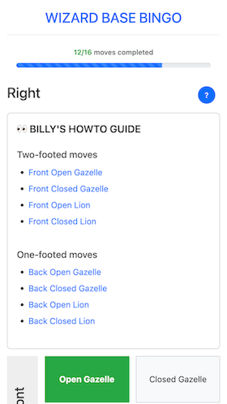

## Cloud architect. Open Source enthusiast. Rollerblader.

**_Engineering manager & Cloud architect by day. Open-source enthusiast by night. Storyteller on wheels all the time._**

I’m Nazrul 👋 

The story of my life: leading engineering teams build secure, governance-first cloud platforms, [crafting open-source tools](https://github.com/nazroll), and [rolling through life one video at a time](https://www.youtube.com/nazroll). I believe great work blends trustworthiness with a spark of fun. 

Rollerblading taught me that every fall is a chance to learn, and the best tricks come from staying curious, honest, and a little daring.

### Latest project

Made a new web app for wizard skaters to track their tricks progression, [Wizard Base Bingo](https://nazroll.com/rockerdapp/). Source code: [https://github.com/nazroll/rockerdapp/](https://github.com/nazroll/rockerdapp/).

---

Directed, edited & submitted a skate video to the [Grand Prix VAR 2025 skate contest](https://www.youtube.com/watch?v=TLCJC9tVLGM). 

